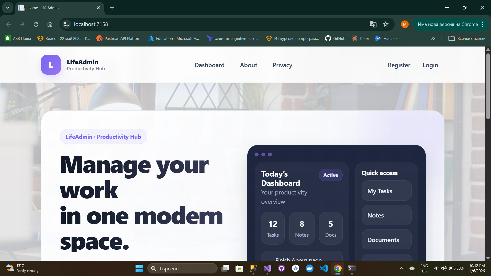
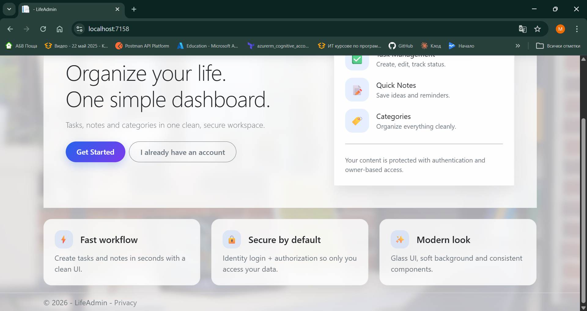
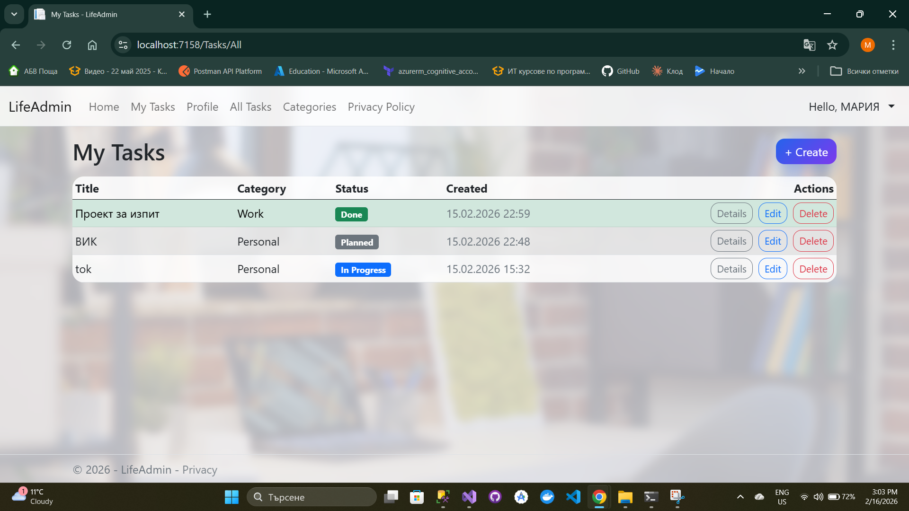
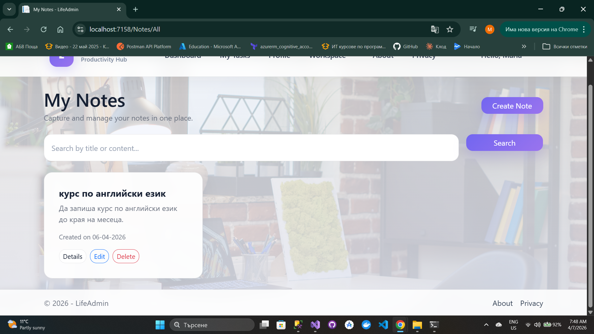
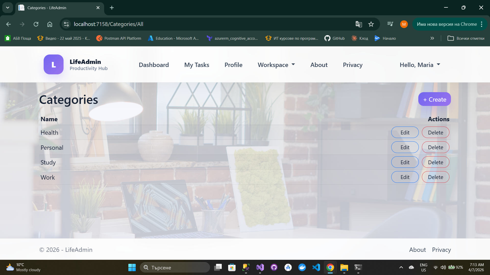
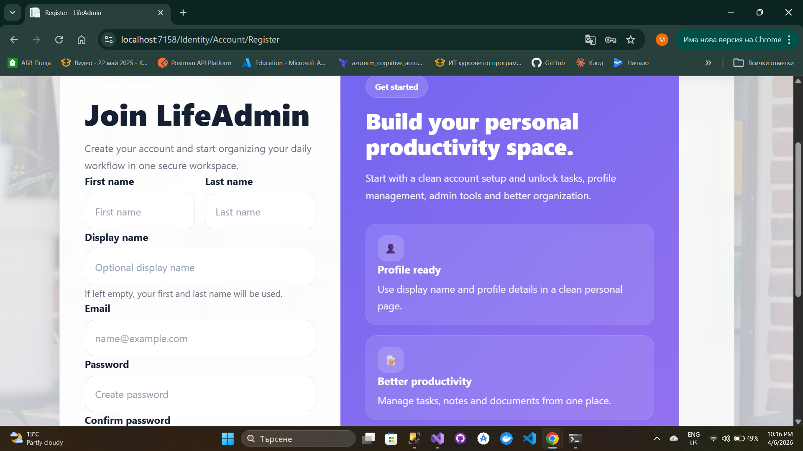
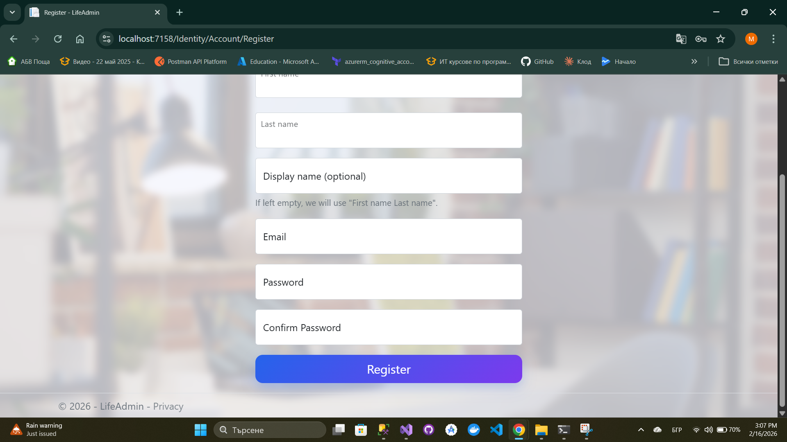

# LifeAdmin

**LifeAdmin** is a modern ASP.NET Core MVC web application for managing  
tasks, notes, and categories in a clean, secure, and user-friendly dashboard.

---

## ✨ Features

- 🔐 User authentication with **ASP.NET Core Identity**
- ✅ Personal **Task Management** (CRUD)
- 📝 **Notes module** for quick ideas and reminders
- 🏷️ **Categories** for better organization
- 📊 Clean **dashboard overview**
- 🎨 Modern **glass-style responsive UI**
- 🔒 Owner-based **authorization & data protection**

---

## 🧱 Architecture

The project follows a clean layered structure:

- **Web (MVC)** – Controllers, Views, UI  
- **Services** – Business logic & data operations  
- **Data** – DbContext, Entities, Migrations  
- **ViewModels** – Input & presentation models  
- **Common (GCommon)** – DataConstants & shared logic  

---

## 🛠️ Technologies

- **ASP.NET Core MVC**
- **Entity Framework Core**
- **SQL Server**
- **ASP.NET Core Identity**
- **Bootstrap 5**
- **C# / .NET**

---

## 🚀 Getting Started

### 1. Clone the repository

bash
git clone https://github.com/merry84/LifeAdminWeb
cd LifeAdminWeb

### 2. Apply database migrations
Update-Database

### 3. Run the application

Open the solution in Visual Studio and press:

Ctrl + F5

## 🔐 User Roles

- User

Manages personal tasks, notes, and categories

Access limited to owned data

- Admin

Can view all tasks

Can manage categories globally

## 📸 Screenshots

### Dashboard

### Tasks

### Notes

### Categories

### Login

### Register pages

## 🎓 Educational Purpose

This project was developed as part of the SoftUni ASP.NET Core learning path
to demonstrate:

MVC web application architecture

Authentication & authorization with Identity

Database design using EF Core

Clean code practices and layered structure

Modern responsive UI development

## 👩‍💻 Author

Maria Tsvetkova
SoftUni Student – ASP.NET & Software Engineering