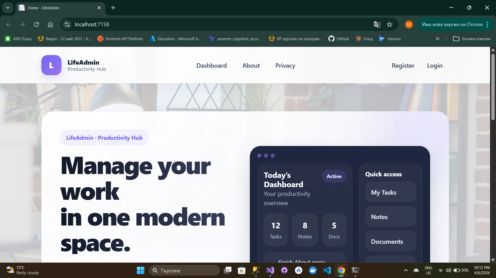
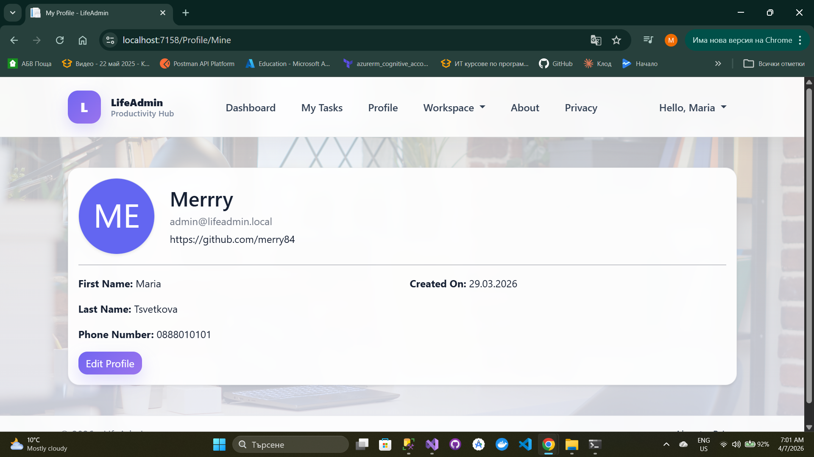
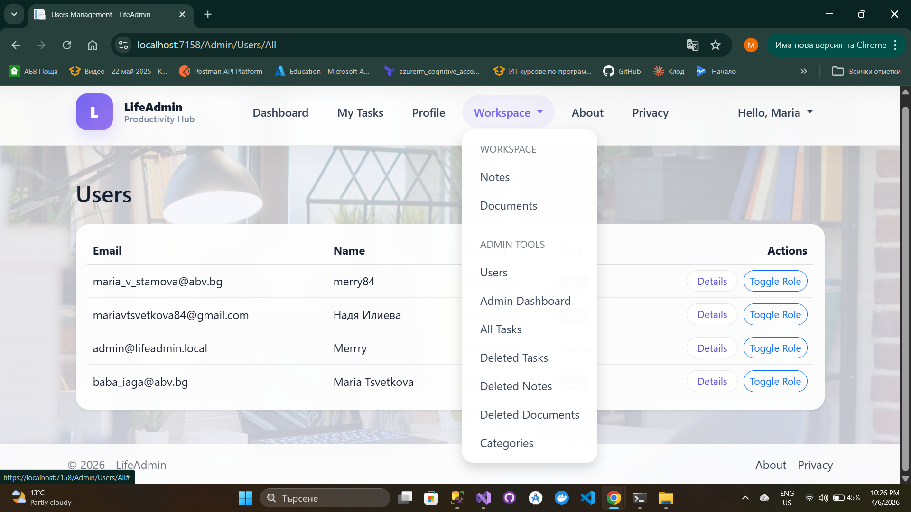
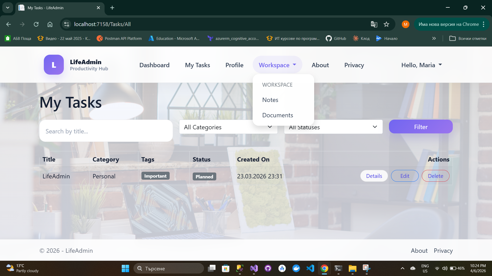
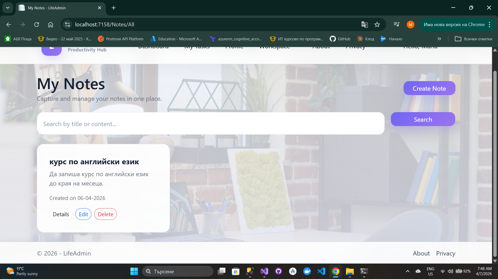
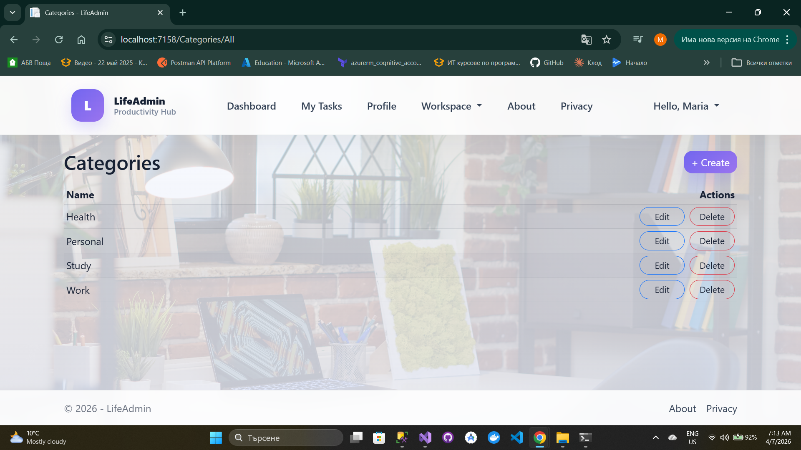
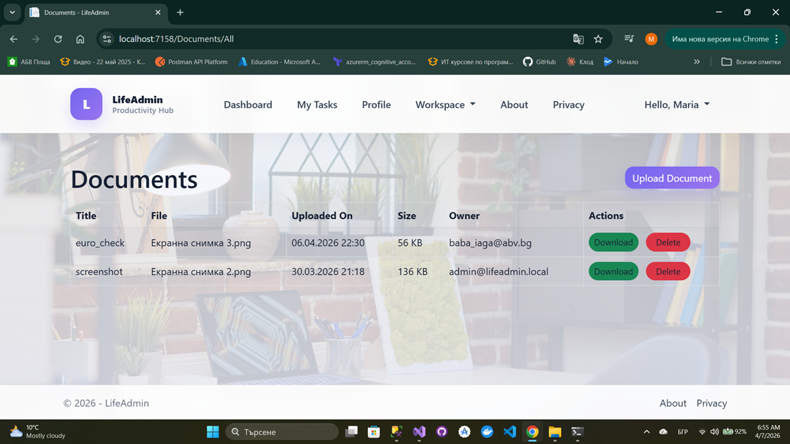
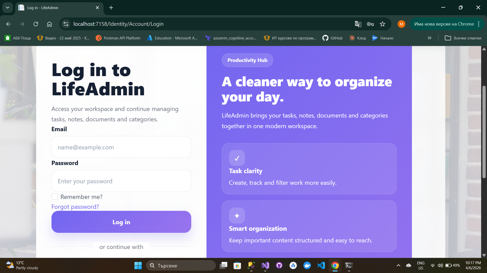
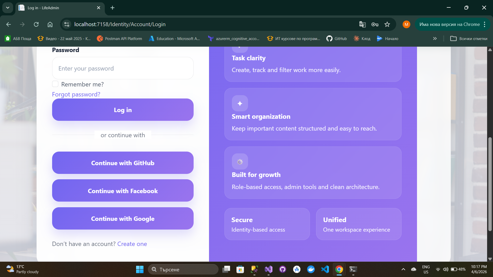
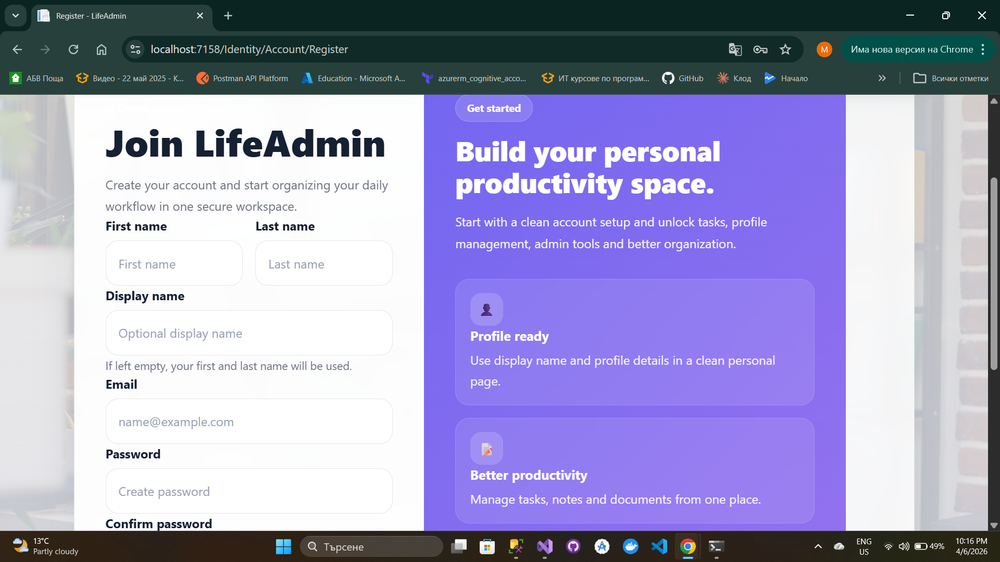

**LifeAdmin** is a modern ASP.NET Core MVC web application designed for managing  
tasks, notes, and categories through a clean, secure, and user-friendly dashboard.

---

## ✨ Features

- 🔐 Authentication & authorization with **ASP.NET Core Identity**
- ✅ Personal **Task Management** (Create, Read, Update, Delete)
- 📝 **Notes module** for quick ideas and reminders
- 🏷️ **Categories** for better organization
- 📄 **Documents module** (upload & manage files)
- 📊 Interactive **dashboard overview**
- 🎨 Modern **glass-style responsive UI**
- 🔒 Owner-based **data protection**
- 🧪 **Unit tests for service layer with high coverage**

---

## 🧱 Architecture

The project follows a clean layered architecture:

- **Web (MVC)** – Controllers, Views, UI  
- **Services** – Business logic & data operations  
- **Data** – DbContext, Entities, Migrations  
- **ViewModels** – Input & presentation models  
- **Common (GCommon)** – Constants & shared logic  

---

## 🛠️ Technologies

- ASP.NET Core MVC (.NET 8)
- Entity Framework Core
- SQL Server (LocalDB)
- ASP.NET Core Identity
- Bootstrap 5
- C#

---

## 🚀 Getting Started

## Requirements

* .NET 8 SDK
* SQL Server LocalDB (installed with Visual Studio)

---

### 1. Clone the repository

```bash
git clone https://github.com/merry84/LifeAdminWeb.git
cd LifeAdminWeb
```

### 2. Apply database migrations

```bash
dotnet ef database update --project .\LifeAdminData\LifeAdminData.csproj --startup-project .\LifeAdmin\LifeAdmin.Web.csproj
```

### 3. Run the application

```bash
dotnet run --project .\LifeAdmin\LifeAdmin.Web.csproj
```

---

## Default Database Configuration

The project uses **SQL Server LocalDB** by default.
You can change the connection string in:

```
appsettings.json
```

---

## 👥 User Roles

### 🧑 User
- Manages personal tasks, notes, and documents  
- Access limited to owned data  

### 👨‍💼 Administrator
- Can view all users' tasks  
- Can manage categories globally  

## 🧪 Testing & Coverage

The project includes unit tests for the Service layer, covering:

- TaskService
- NotesService
- DocumentService
- CategoryService
- TagService
- ProfileService
- DashboardService

📊 Coverage is generated using ReportGenerator.

## 📸 Screenshots

### Dashboard


### Profile


### Admin Dashboard


### Tasks


### Notes


### Categories


### Documents


### Login



### Register pages



## 🎓 Educational Purpose

This project was developed as part of the SoftUni ASP.NET Core learning path
to demonstrate:

MVC web application architecture

Authentication & authorization with Identity

Database design using EF Core

Clean code practices and layered structure

Unit testing and code coverage

Modern responsive UI development

👩‍💻 Author

Maria Tsvetkova
SoftUni Student – ASP.NET & Software Engineering